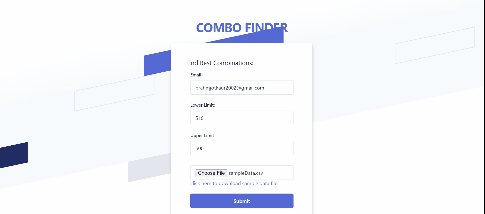
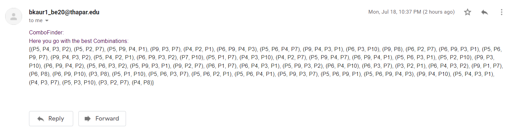

<h4 >A Django based App which allows a user to figure out what Products he/she must include in a Combo by simply specifying the Product Costs in csv file(Sample attached in app) and Price bounds(Upper and Lower Limit) This App will automatically send Combos generated to the User's email defined by user on website.</h4>

<h4>Access the website through the link: </h4>
<a href="combofinder.realhubble.tech">combofinder.realhubble.tech</a>
<h3 align="left">Languages and Tools:</h3>

     

<h3 align="left">Frontend</h3>

<h3 align="left">Email</h3>

